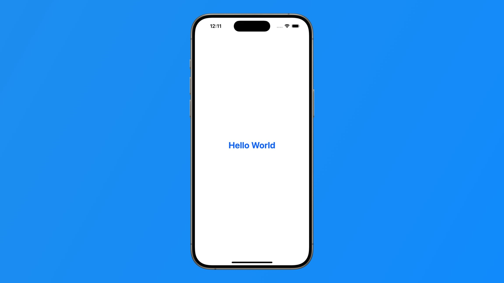
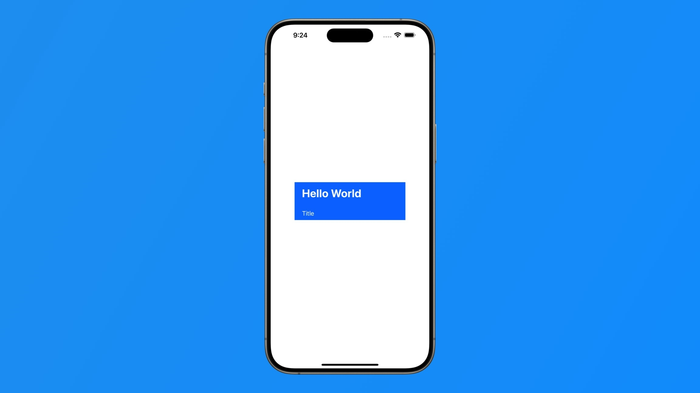
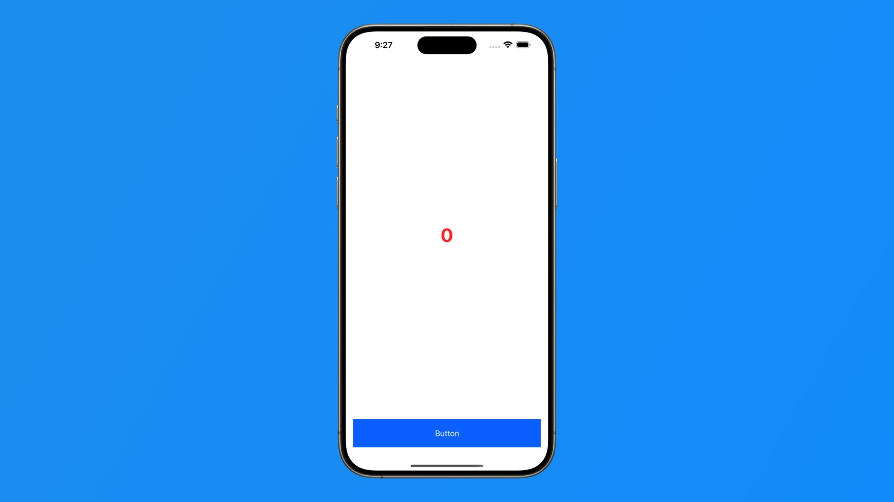
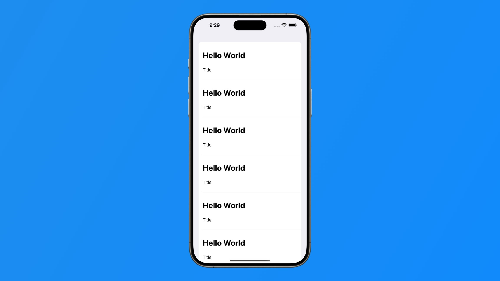
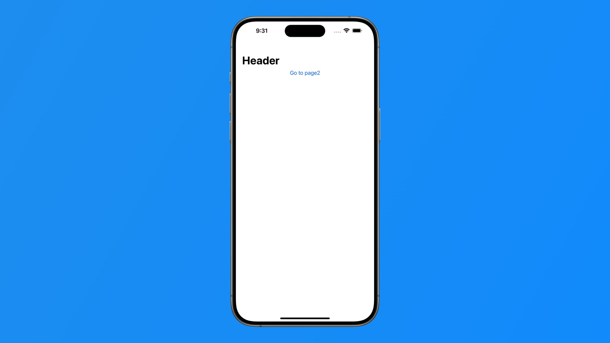
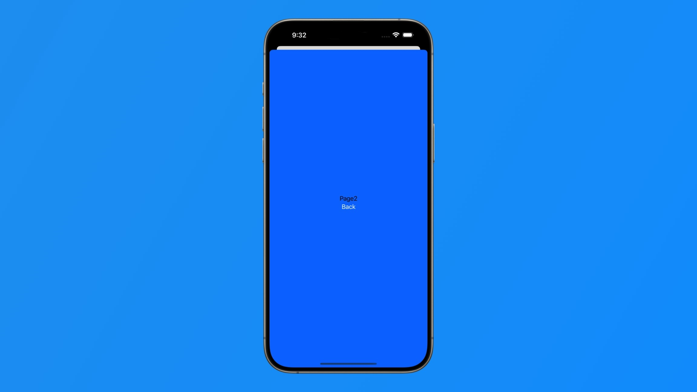

# SwiftUI Beginner 30Days

針對從零開始學習 SwiftUI 的基礎範例

| Day | Title | --  |
| --- | ---   | --- |
| 1   | [新建專案](Day1/Day1/ContentView.swift) |  |
| 2   | [基本排版](Day2/Day2/ContentView.swift) |  |
| 3   | [按鈕](Day3/Day3/ContentView.swift) |  |
| 4   | [列表](Day4/Day4/ContentView.swift) |  |
| 5   | [NavigationView 導航容器](Day5/Day5/ContentView.swift) |  |
| 6   | [變數 Binding](Day6/Day6/ContentView.swift) |  |
| 7   | [sheet 換頁](Day7/Day7/ContentView.swift) |  |
| 8   | | |
| 9   | | |
| 10   | | |
| 11   | | |
| 12   | | |
| 13   | | |
| 14   | | |
| 15   | | |
| 16   | | |
| 17   | | |
| 18   | | |
| 19   | | |
| 20   | | |
| 21   | | |
| 22   | | |
| 23  | | |
| 24   | | |
| 25   | | |
| 26   | | |
| 27   | | |
| 28   | | |
| 29   | | |
| 30   | | |